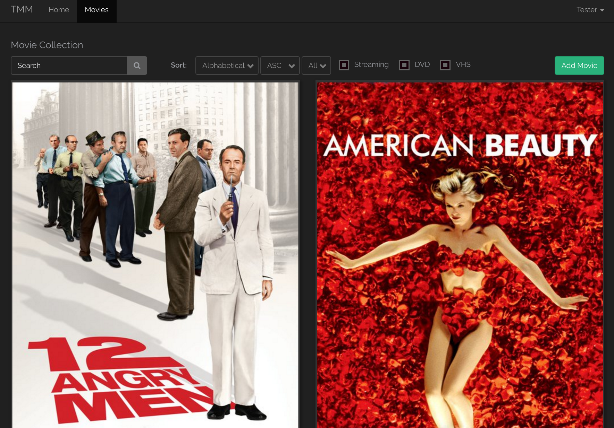

# TylerMovieManager

A movie management application using a REST API built with Laravel.




## Dependencies

* [docker](https://docs.docker.com/engine/installation/)
* [docker-compose](https://docs.docker.com/compose/install/)

## Installation

For development, nginx expects the domain `tmm.8ed.local`, add that to `/etc/hosts/`:

```
sudo echo "127.0.0.1 tmm.8ed.local" >> /etc/hosts
```

An `.env` file is also required to set up environment variables, laravel should automatically copy the `.env.example` file to `.env` if `.env` is not found.

Generate oauth keys and install vendor packages:

```
composer install
php artisan passport:install
```

Optionally, you can register an API key with [Guidebox](https://api.guidebox.com/apidocs) for additional data about your movies.

## Usage

The stack runs in docker, which can be started with:

```
docker-compose up
```

This setups a database, and an nginx + php5-fpm container to serve the Laravel project located in `src`. 

Visit [http://tmm.8ed.local](http://tmm.8ed.local) in your web browser and create a new user.

Default login is [test@test.com/test123](https://github.com/z/TylerMovieManager/blob/master/src/database/seeds/UsersTableSeeder.php#L16)

## Deployment

Create a `docker-compose.prod.yml` file based on `docker-compose.override.yml` and edit your `.env` to match production.

Bring it up with:

```
docker-compose -f docker-compose.yml -f docker-compose.prod.yml up
```

### Automated (optional)

Take a look at the `extra/git/hooks/post-receive` hook to setup automated deployments when you push to a special remote.

## Developer Notes

```bash
# dockerized composer
alias composer='docker run -it --rm --net=host -v $HOME:$HOME -e COMPOSER_HOME="$HOME/.composer" -u $UID -w `pwd` composer/composer:master-php5-alpine'
```

The `src` base was generated with composer:

```bash
cd src
composer create-project --prefer-dist laravel/laravel .
```

Permissions on directories:

```
chown -R $USER:$USER .
chmod -R o+w bootstrap/cache
chmod -R o+w storage
```

If you have any issues starting up, try the following:

```
# clear cache and compiled classes
php artisan cache:clear
php artisan clear-compiled

# regen the autoload file
composer dump-autoload
```

## License

Copyright (c) 2016 Tyler Mulligan (z@xnz.me) and contributors.

Distributed under the MIT license. See the LICENSE file for more details.
